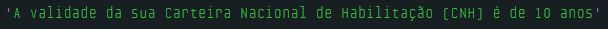
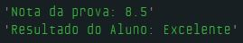
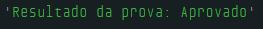
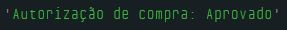
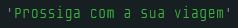
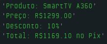

# Dia 4 - Tomando Decisões com Estrutura de Controle Condicional

## DESAFIO 01: Renovação CNH

**Descrição**: Calcule em quanto tempo a carteira de motorista irá vencer de acordo com a legislação.

1. Se você está tirando a carteira pela 1ª vez, o tempo de vencimento é de 1 ano;
2. Se você tem idade inferior a 50 anos, o vencimento é de 10 anos;
3. Se for igual ou superior a 50 anos ou inferior a 70 anos, o vencimento é de 5 anos;
4. Se for igual ou superior a 70 anos, o vencimento será de 3 anos;

```js
let idade = 35;
let primeiraHabilitacao = false;
let validade;

// Verifica se é a primeira habilitação e a idade
if (primeiraHabilitacao) {
    validade = "1 ano";
} else if ((idade >= 18) && (idade < 50)) {
    validade = "10 anos";
} else if ((idade >= 50) && (idade < 70)) {
    validade = "5 anos";
} else if (idade >= 70) {
    validade = "3 anos";
} else {
    console.log("Você não pode tirar a habilitação");
}

console.log("A validade da sua Carteira Nacional de Habilitação (CNH) é de " + validade);
```



## DESAFIO 02: Performance de Aluno

**Descrição**: Informe para um aluno a sua performance em uma prova a partir da sua nota.

1. Se a nota for menor que 5, então mostra que foi "Insuficiente";
2. Se foi menor que 6, então mostre "Regular";
3. Se foi menor que 7.5, mostre "Bom";
4. Se foi menor que 9, "Muito Bom";
5. Se for maior ou igual a 9, mostre "Excelente".

```js
let notaDoAluno = 8.5
let resultado;

// Verifica a nota do aluno
if (notaDaProva < 5) {
    resultado = "Insuficiente";
} else if (notaDaProva < 6) {
    resultado = "Regular";
} else if (notaDaProva < 7.5) {
    resultado = "Bom";
} else if (notaDaProva < 9) {
    resultado = "Muito Bom";
} else if (notaDaProva >= 9) {
    resultado = "Excelente";
}

console.log("Nota da prova: " + notaDoAluno);
console.log("Resultado do Aluno: " + resultado);
```



## DESAFIO 03: Transforme o Código em uma Condição Ternária

**Descrição**: Converta essa forma de condicional em uma condição ternária.

### Código Anterior:

```js
let nota = 85;
let status;

if (nota >= 70) {
    status = "Aprovado";
} else {
    status = "Reprovado";
}

console.log(status);
```

### Código Usando Condição Ternária:

```js
let nota = 85;

// Usando Condição Ternária
let status = nota >= 70 ? "Aprovado" : "Reprovado";

console.log("Resultado da prova: " + status);
```



## DESAFIO 04: Condição ternária com expressão mais complexa

**Descrição**: Escreva um código que determina se o cliente pode fazer compras com sua conta. As condições para poder comprar são:

1. A conta precisa estar ativa;
2. Saldo deve ser maior que R$500;
3. Use a condição ternária para isso.

```js
let contaAtivada = true;
let contaSaldo = 550;

// Verifica se a conta está ativada e se possui saldo superior a R$500
let verificacao = contaAtivada && (contaSaldo > 500) ? "Aprovado" : "Negado";

console.log("Autorização de compra: " + verificacao);
```



## DESAFIO 05: Cancela de Estacionamento

**Descrição**: Crie um código usando switch que imprima uma mensagem adequada para o motorista. O sistema tem três possíveis estados: "Aberta", "Fechada" e "Manutenção".

```js
let estadoDaCancela = "Aberta";

// Exibe a mensagem a depender do estado da cancela
switch (estadoDaCancela) {
  case "Aberta":
    console.log("Prossiga com a sua viagem");
    break;
  case "Fechada":
    console.log("Aguarde a sua verificação");
    break;
  case "Manutenção":
    console.log("Estamos realizando manutenção preventiva");
    break;
  default:
    console.log("Fora de Serviço");
}
```



## DESAFIO 06: Sistema de PDV (Ponto de Venda)

**Descrição**: Crie um código usando switch que calcule e imprima o valor final do produto após a aplicação do desconto, com base no tipo do produto.

O desconto é dado com base no tipo do produto:

- "Alimentos" têm um desconto de 5%;
- "Eletrônicos" têm um desconto de 10%;
- "Roupas" têm um desconto de 20%;
- "Livros" têm um desconto de 50%;
- Se o tipo do produto não estiver na lista, não há desconto;

```js
let nomeProduto = 'SmartTV A360';
let tipoDoProduto = 'Eletrônicos';
let valorProduto = 1299;
let descontoPorTipo;

// Verifica o tipo do produto e aplica o desconto
switch (tipoDoProduto) {
  case 'Alimentos':
    descontoPorTipo = 5;
    break;
  case 'Eletrônicos':
    descontoPorTipo = 10;
    break;
  case 'Roupas':
    descontoPorTipo = 20;
    break;
  case 'Livros':
    descontoPorTipo = 50;
    break;
  default:
    descontoPorTipo = 0;
}

console.log('Produto: ' + nomeProduto);
console.log('Preço: R$' + valorProduto.toFixed(2));

if (descontoPorTipo !== 0) {
    let valorDesconto = (descontoPorTipo / 100) * valorProduto;
    let descontoDoProduto = valorProduto - valorDesconto;

    console.log('Desconto: ' + descontoPorTipo + '%');
    console.log('Total: R$' + descontoDoProduto.toFixed(2) + ' no Pix');
} else {
    console.log('Este produto não possui desconto');
}
```

