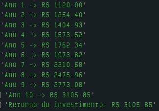
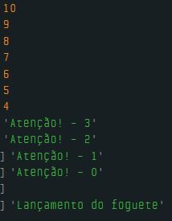
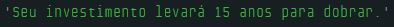
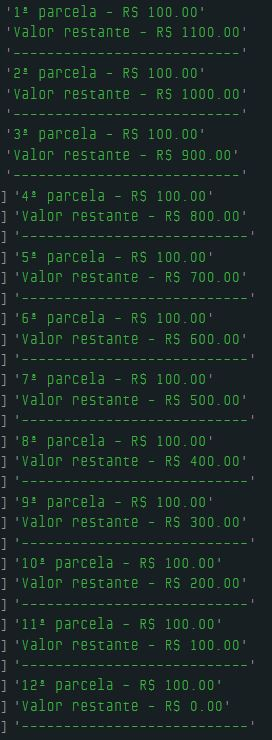

# Dia 5 - Estrutura de Controle de Repetição (Loops)

## DESAFIO 01: Rendimento de Aplicação Financeira

**Descrição**: Suponha que você investiu R$ 1.000 em uma aplicação financeira que rende 12% ao ano. Usando um loop for, calcule como esse investimento cresce ao longo do tempo, nos próximos 10 anos.

Mostre o valor no console por ano.

```js
const capitalInicial = 1000; // Capital a ser investido
const taxaJuros = 0.12; // Taxa de juros (12% ao ano)
const tempoInvestido = 10; // Número de anos investindo

let valorFuturo = capitalInicial;

for (let i = 1; i <= tempoInvestido; i++) {
    valorFuturo = valorFuturo * (1 + taxaJuros);
    console.log("Ano " + i + " -> R$ " + valorFuturo.toFixed(2));
}

console.log("Retorno do investimento: R$ " + valorFuturo.toFixed(2));
```



## DESAFIO 02: Contagem Regressiva para lançamento de foguete

**Descrição**: Faça a contagem regressiva a partir de 10 até o lançamento de um foguete.

Ao chegar nos últimos 3 segundos, é importante dar um aviso, então inclua o texto "Atenção!" junto a contagem. Quando a contagem terminar mostre a mensagem: "Lançamento do foguete".

```js
for (let i = 10; i >= 0; i--) {
    if (i <= 3) {
        console.log("Atenção! - " + i);
    } else {
        console.log(i);
    }
}
console.log("");
console.log("Lançamento do foguete");
```



## DESAFIO 03: Cálculo de Juros

**Descrição**: Calcule quanto tempo (em anos) levará para que um investimento inicial dobre, considerando uma taxa de juros de 5% ao ano.

```js
let valorInvestido = 1000; // Capital inicial
let taxaJuros = 0.05; // Taxa de juros anual
let investimentoDesejado = valorInvestido * 2;

let anosInvestindo = 0;

while (valorInvestido < investimentoDesejado) {
    valorInvestido += valorInvestido * taxaJuros;
    anosInvestindo++;
}

console.log("Seu investimento levará " + anosInvestindo + " anos para dobrar.");
```



## DESAFIO 04: Compra Parcelada

**Descrição**: Você comprou um produto e optou por parcelar o valor em 12x sem juros. Escreva um código que imprima o valor de cada parcela e o valor restante a ser pago.

```js
let valorProduto = 1200;
let numeroParcelas = 12;

let valorParcela = valorProduto / numeroParcelas;

for (let i = 1; i <= numeroParcelas; i++) {
    valorProduto -= valorParcela;
    console.log(i + "ª parcela - R$ " + valorParcela.toFixed(2));
    console.log("Valor restante - R$ " + valorProduto.toFixed(2));
    console.log("---------------------------");
}
```

