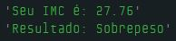
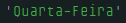
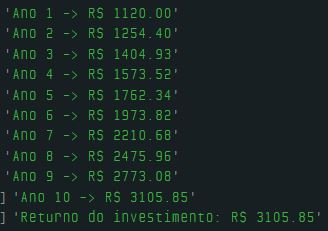

# Dia 6 - Encaixotando Códigos com Funções e Procedimentos

## DESAFIO 01:

**Descrição**: Crie uma função que utiliza o peso e a altura como parâmetros para calcular o **IMC** (Índice de Massa Corporal) de uma pessoa.

```js
function calcularIMC(peso, altura) {
    let imc = peso / (altura * altura);

    console.log("Seu IMC é: " + imc.toFixed(2));

    if (imc < 18.5) {
        console.log("Resultado: Abaixo do peso");
    } else if ((imc >= 18.5) && (imc < 24.9)) {
        console.log("Resultado: Peso normal");
    } else if ((imc >= 24.9) && (imc < 29.9)) {
        console.log("Resultado: Sobrepeso");
    } else {
        console.log("Resultado: Obesidade");
    }
    return imc;
}

calcularIMC(85, 1.75);
```



## DESAFIO 02: Dia da Semana por Extenso

**Descrição**: Transforme o código que criamos no dia 4 sobre os dias de semana em uma função chamada `obterDiaDaSemana`.

Receba um número que representa o dia da semana que vai de 1 a 7 e retorne esse dia por extenso.

```js
function obterDiaDaSemana(diaNumero) {
    let diaDaSemana;

    switch(diaNumero) {
        case 1:
            diaDaSemana = "Domingo";
            break;
        case 2:
            diaDaSemana = "Segunda-Feira";
            break;
        case 3:
            diaDaSemana = "Terça-Feira";
            break;
        case 4:
            diaDaSemana = "Quarta-Feira";
            break;
        case 5:
            diaDaSemana = "Quinta-Feira";
            break;
        case 6:
            diaDaSemana = "Sexta-Feira";
            break;
        case 7:
            diaDaSemana = "Sábado";
            break;
        default:
            diaDaSemana = "Dia da Semana inexistente";
    }
    return diaDaSemana;
}

console.log(obterDiaDaSemana(4));
```



## DESAFIO 03: Aplicação Financeira

**Descrição**: Volte ao dia 5, no desafio 1, e crie um função que fará todo o cálculo que detalhamos no desafio.

Você tem um valor inicial de uma aplicação financeira que rende um percentual ao ano. Calcule como esse investimento cresce no decorrer do ano.

```js
function investimento(capitalInicial, taxaJuros, tempoInvestido) {
    let valorFuturo = capitalInicial;

    for (let i = 1; i <= tempoInvestido; i++) {
        valorFuturo = valorFuturo * (1 + taxaJuros);
        console.log("Ano " + i + " -> R$ " + valorFuturo.toFixed(2));
    }

    return "Returno do investimento: R$ " + valorFuturo.toFixed(2);
}

console.log(investimento(1000, 0.12, 10));
```

