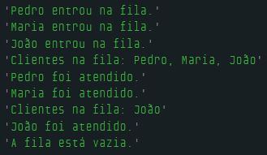

# Dia 8 - A Brincadeira Só Começa com Estrutura de Dados

## DESAFIO 01: Filas e Mais Filas

**Descrição**: Identifique 4 tipos diferentes de filas que existem no mundo real. Para cada tipo de fila, descreva como ela funciona em tópicos e com suas palavras.

Lembre-se de que uma fila é um conceito finito e tem um limite para a quantidade de elementos, assim como a memória dos computadores.

    1. Fila de supermercado

        Cada cliente entra no fim da fila (último a chegar).
        O primeiro da fila é atendido no caixa (primeiro a sair).
        A fila tem um limite: o espaço físico do supermercado (não dá pra enfileirar infinitamente).
        Quando um caixa abre ou fecha, a organização pode mudar, mas a lógica da fila continua.

    2. Fila de impressão (na impressora)

        Os arquivos enviados para impressão entram na fila em ordem de chegada.
        A impressora imprime um arquivo de cada vez, na ordem em que chegaram.
        A fila de impressão tem um limite baseado na memória da impressora ou do servidor.
        Se muitos arquivos forem enviados, os últimos podem ter que esperar muito ou nem serem impressos se não tiver papel ou tinta.

    3. Fila de carros no pedágio

        Cada carro chega e entra atrás do último veículo.
        O carro na frente paga e sai primeiro, liberando espaço.
        Pode haver múltiplas filas paralelas.
        O limite é físico: número de carros que cabem na estrada até o pedágio.
        Em horários de pico, atinge o limite e começa o congestionamento (excesso de elementos na fila).

    4. Fila de chamadas em uma central de atendimento (call center)

        Quando todas as atendentes estão ocupadas, as chamadas entram em uma fila de espera.
        A próxima chamada a ser atendida é geralmente a que está há mais tempo esperando.
        Algumas centrais aplicam prioridades (clientes VIP, por exemplo), criando uma fila com prioridades.
        A fila tem um limite: número máximo de chamadas que o sistema consegue armazenar.
        Se o limite for atingido, novas chamadas recebem mensagem de erro ou são desligadas automaticamente.

## DESAFIO 02: Fila de Supermercado em Código

**Descrição**: Crie um código que simule uma fila de supermercado. Comece com uma fila simples de um único caixa e, posteriormente, expanda para simular a fila em diversos caixas. Considere operações como adicionar clientes à fila e atendê-los (remover clientes da fila).

Lembre-se de que para sair da fila, os clientes são atendidos em ordem, e você pode usar operações de array para gerenciar isso.

```js
let fila = [];

function entrarNaFila(nome) {
    fila[fila.length] = nome;
    console.log(`${nome} entrou na fila.`);
}

function atenderCliente() {
    if (fila.length > 0) {
        let clienteAtendido = fila[0];

        for (let i = 1; i < fila.length; i++) {
            fila[i - 1] = fila[i];
        }
        fila.length = fila.length - 1;
        console.log(`${clienteAtendido} foi atendido.`);
    } else {
        console.log("Não há clientes na fila para atender.");
    }
}

function mostrarFila() {
    if (fila.length > 0) {
        console.log("Clientes na fila: " + fila.join(", "));
    } else {
        console.log("A fila está vazia.");
    }
}

entrarNaFila("Pedro");
entrarNaFila("Maria");
entrarNaFila("João");

mostrarFila();
atenderCliente();
atenderCliente();

mostrarFila();
atenderCliente();
mostrarFila();
```

