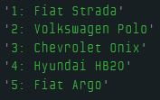

# Dia 9 - Super Poderes na Manipulação de Arrays

## DESAFIO 01: Recrie funções úteis em Arrays

**Descrição**: Reescreva as funções: indexOf, includes e o lastIndexOf no JavaScript.

### Função recriada para `indexOf()`

```js
const redesSociais = [
    "Instagram",
    "YouTube",
    "Facebook",
    "TikTok",
    "LinkedIn",
    "Pinterest",
    "Bluesky"
];

function meuIndexOf(arr, redeSocial) {
    for (let i = 0; i < redeSocial.length; i++) {
        if (arr[i] === redeSocial) {
            return i;
        }
    }
    return -1;
}

console.log(meuIndexOf(redesSociais, "LinkedIn")); // retorna 4
```

### Função recriada para `includes()`

```js
const redesSociais = [
    "Instagram",
    "YouTube",
    "Facebook",
    "TikTok",
    "LinkedIn",
    "Pinterest",
    "Bluesky"
];

function meuIncludes(arr, redeSocial) {
    for (let i = 0; i < arr.length; i++) {
        if (arr[i] === redeSocial) {
            return true;
        }
    }
    return false;
}

console.log("meuIncludes: " + meuIncludes(redesSociais, "LinkedIn")); // retorna true
```

### Função recriada para `lastIndexOf()`

```js
const redesSociais = [
    "Instagram",
    "YouTube",
    "Facebook",
    "TikTok",
    "Twitter",
    "YouTube",
    "LinkedIn",
    "Pinterest",
    "Twitter"
];

function meuLastIndexOf(arr, redeSocial) {
    for (let i = arr.length; i > 0; i--) {
        if (arr[i] === redeSocial) {
            return i;
        }
    }
    return -1;
}

console.log("meuLastIndexOf: " + meuLastIndexOf(redesSociais, "YouTube")); // retorna 5
```

## DESAFIO 02: Um Novo Slice

**Descrição**: Recrie o `slice()`, fazendo o seu da sua maneira.

```js
let carrosMaisVendidos = [
    "Fiat Strada",
    "Volkswagen Polo",
    "Chevrolet Onix",
    "Hyundai HB20",
    "Fiat Argo",
    "Volkswagen T-Cross",
    "Fiat Mobi",
    "Hyundai Creta",
    "Chevrolet Tracker",
    "Chevrolet Onix Plus"
];

function meuSlice(arr, inicio = 0, fim = arr.length) {
    let arrSlice = [];

    if (inicio < 0) inicio = arr.length + inicio;

    if (fim < 0) fim = arr.length + fim;

    for (let i = inicio; i < fim && i < arr.length; i++) {
        arrSlice.push(arr[i]);
    }

    return arrSlice;
}

let top5Carros = meuSlice(carrosMaisVendidos, 0, 5);

for (let i = 0; i < top5Carros.length; i++) {
    console.log(`${i + 1}: ${top5Carros[i]}`);
}
```

