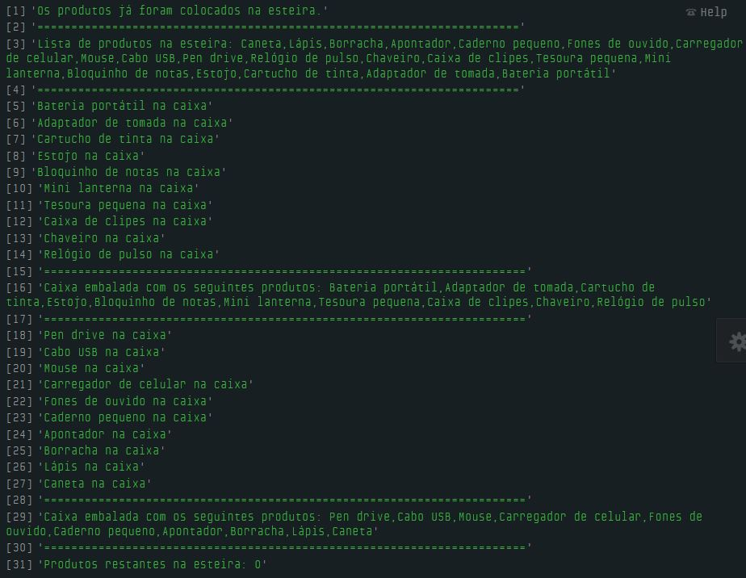

# Dia 10 - Como Empilhar Coisas te Ensina Sobre Estrutura de Dados

## DESAFIO 01: Braço Mecânico para Empilhar Produtos

**Descrição**: Na linha de produção, um braço mecânico automatizado é encarregado de pegar produtos individuais que chegam através de uma esteira e empilhá-los em caixas para envio.
Cada caixa pode conter até no máximo 10 produtos. Uma vez que a caixa está cheia, ela é enviada para ser selada e despachada.

*Empilhar*. O braço mecânico pega um produto da esteira e o coloca no topo da pilha atual.

*Verificar a Capacidade*. Antes de empilhar um novo produto, o sistema verifica se a pilha já contém 10 produtos.

*Criar uma Nova Pilha*. Uma vez que a pilha atinge 10 produtos, ela é enviada para o próximo estágio do processo (selagem e despacho), e uma nova pilha vazia é iniciada para os próximos produtos.

```js
const esteira = [
    "Caneta",
    "Lápis",
    "Borracha",
    "Apontador",
    "Caderno pequeno",
    "Fones de ouvido",
    "Carregador de celular",
    "Mouse",
    "Cabo USB",
    "Pen drive",
    "Relógio de pulso",
    "Chaveiro",
    "Caixa de clipes",
    "Tesoura pequena",
    "Mini lanterna",
    "Bloquinho de notas",
    "Estojo",
    "Cartucho de tinta",
    "Adaptador de tomada",
    "Bateria portátil"
];

let caixa = [];
const capacidadeMaxima = 10;

function empilharProdutos() {

    verificarCapacidade();

    let produtoEmpilhado = esteira.pop();
    caixa.push(produtoEmpilhado);
    console.log(`${produtoEmpilhado} na caixa`);
}

function verificarCapacidade() {
    if (isFull()) {
        criarNovaPilha();
    }
}

function isFull() {
    if (caixa.length < capacidadeMaxima) {
        return false;
    }
    return true;
}

function criarNovaPilha() {
    console.log("=======================================================================");
    console.log(`Caixa embalada com os seguintes produtos: ${caixa}`);
    console.log("=======================================================================");
    caixa = []; // esvazia a pilha
}

console.log('Os produtos já foram colocados na esteira.');
console.log("=======================================================================");
console.log(`Lista de produtos na esteira: ${esteira}`);
console.log("=======================================================================");

let tamanhoDaEsteira = esteira.length;

for (let i = 0; i < tamanhoDaEsteira; i++) {
    empilharProdutos();
}

criarNovaPilha();

console.log(`Produtos restantes na esteira: ${esteira.length}`);
```

