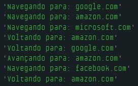

# Dia 11 - Pilhas no Mundo Real

## DESAFIO: Controle de Navegação em Navegadores Web

**Descrição**:

1. Pilha de Voltar:
Quando você navega de uma página para outra, a página atual é empurrada (pushed) para a pilha de voltar. Se você continuar navegando por várias páginas, elas serão empilhadas em ordem. Quando você clica no botão "voltar", o topo da pilha de voltar é retirado (popped) e a página é exibida.

2. Pilha de Avançar:
Quando você clica em "voltar", a página da qual você voltou é empurrada para a pilha de avançar. Se você clicar em "avançar", você tira (pop) da pilha de avançar e navega para a página.

    I - Crie 3 funções, uma que controla o voltar, uma para o avançar e outra para navegar para um endereço.

    II - Controle a partir de 2 pilhas e uma variável que armazena o endereço da página atual.

```js
let pilhaVoltar = [];
let pilhaAvancar = [];
let paginaAtual = null;

function navegarPara(pagina) {
    if (paginaAtual) {
        pilhaVoltar.push(paginaAtual);
        pilhaAvancar = [];
    }

    paginaAtual = pagina;
    console.log("Navegando para: " + paginaAtual);
}

function voltar() {
    if (!pilhaVoltar.length) {
        console.log("Não há paginas anteriores.");
        return;
    }

    pilhaAvancar.push(paginaAtual);

    paginaAtual = pilhaVoltar.pop();
    console.log("Voltando para: " + paginaAtual);
}

function avancar() {
    if (!pilhaAvancar.length) {
        console.log("Não há páginas à frente.");
        return;
    }

    pilhaVoltar.push(paginaAtual);

    paginaAtual = pilhaAvancar.pop();
    console.log("Avançando para: " + paginaAtual);
}

navegarPara("google.com");
navegarPara("amazon.com");
navegarPara("microsoft.com");
voltar();  // volta para 'amazon.com'
voltar();  // volta para 'google.com'
avancar(); // volta para 'amazon.com'

navegarPara("facebook.com");
voltar(); // volta para 'amazon.com'
```

