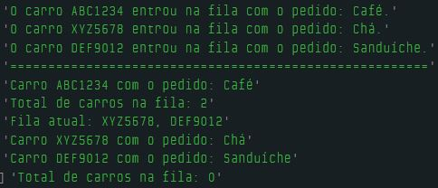

# Dia 12 - Filas do Mundo Real

## DESAFIO: Fila de atendimento em um Drive Through

**Descrição**: Criar uma fila de atendimento de clientes em uma cafeteria Drive Through. Todo atendimento é realizado a partir de carros que vão entrando no estacionamento da cafeteria e recebendo os pedidos a partir de um totem eletrônico.

```js
let filaDriveThru = [];

function entrarNaFila(placaDoCarro, pedido) {
    filaDriveThru.push([placaDoCarro, pedido]);
    console.log(`O carro ${placaDoCarro} entrou na fila com o pedido: ${pedido}.`);
}

function atenderCarro() {
    if (filaDriveThru.length === 0) {
        console.log("Não há carros na fila.");
    } else {
        let carroAtendido = filaDriveThru.shift();
        console.log(`Carro ${carroAtendido[0]} com o pedido: ${carroAtendido[1]}.`);
    }
}

function statusDaFila() {
    console.log(`Total de carros na fila: ${filaDriveThru.length}`);
    
    if (filaDriveThru.length > 0) {
        console.log("Fila atual: " + filaDriveThru.map(carro => carro[0]).join(", "));
    }
}

// Simulação de carros entrando na fila
entrarNaFila("ABC1234", "Café");
entrarNaFila("XYZ5678", "Chá");
entrarNaFila("DEF9012", "Sanduíche");

console.log("=======================================================");

atenderCarro();

statusDaFila();

atenderCarro();
atenderCarro();

statusDaFila();
```

