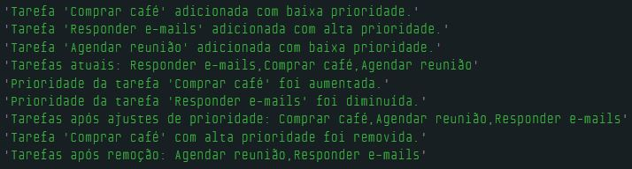

# Dia 13 - Desafios Desafiadores com Deques

## DESAFIO: Controle de Tarefas Dinâmicas com Prioridades

**Descrição**: Crie um controle que regencia tarefas com prioridade. O objetivo é simular um ambiente onde tarefas urgentes podem surgir a qualquer momento, exigindo reorganização rápida e eficiente da fila de tarefas.

    Objetivos do desafio:

    - Implementar um Deque para Tarefas
    - Manipulação de Prioridades
    - Testar com Cenários Realistas

```js
const tarefas = [];

// Tarefa com alta prioridade é inserida no início do array
function inserirInicio(tarefa) {
    tarefas.unshift(tarefa);
    console.log(`Tarefa '${tarefa}' adicionada com alta prioridade.`);
}

// Tarefa com baixa prioridade é inserida no fim do array
function inserirFim(tarefa) {
    tarefas.push(tarefa);
    console.log(`Tarefa '${tarefa}' adicionada com baixa prioridade.`);
}

// Remover tarefa com alta prioridade
function removerInicio() {
    if (!estaVazio()) {
        console.log(`Tarefa '${tarefas.shift()}' com alta prioridade foi removida.`);
    } else {
        console.log("Não há tarefas para remover.");
    }
}

// Remover tarefa com baixa prioridade
function removerFim() {
    if (!estaVazio()) {
        console.log(`Tarefa '${tarefas.pop()}' com baixa prioridade foi removida.`);
    } else {
        console.log("Não há tarefas para remover.");
    }
}

// Verificar se o deque de tarefas está vazio
function estaVazio() {
    return tarefas.length === 0;
}

// Obter tarefas
function obterTarefas() {
    return tarefas.slice();
}

// Aumentar a prioridade de uma tarefa
function aumentarPrioridade(tarefa) {
    let index = tarefas.indexOf(tarefa);

    if (index > 0) {
        let temp = tarefas[index - 1];
        tarefas[index - 1] = tarefas[index];
        tarefas[index] = temp;
        console.log(`Prioridade da tarefa '${tarefa}' foi aumentada.`);
    } else {
        console.log("A tarefa já está com a máxima prioridade ou não existe.");
    }
}

// Diminuir a prioridade de uma tarefa
function diminuirPrioridade(tarefa) {
    let index = tarefas.indexOf(tarefa);

    if (index !== -1 && index < tarefas.length - 1) {
        let temp = tarefas[index + 1];
        tarefas[index + 1] = tarefas[index];
        tarefas[index] = temp;
        console.log(`Prioridade da tarefa '${tarefa}' foi diminuída.`);
    } else {
        console.log("A tarefa já está com a mínima prioridade ou não existe.");
    }
}

// Gerenciamento de tarefas
inserirFim("Comprar café");         // baixa prioridade
inserirInicio("Responder e-mails"); // alta prioridade
inserirFim("Agendar reunião");      // baixa prioridade

console.log("Tarefas atuais: " + obterTarefas()); // retorna lista de tarefas

aumentarPrioridade("Comprar café");
diminuirPrioridade("Responder e-mails");

console.log("Tarefas após ajustes de prioridade: " + obterTarefas()); // retorna lista de tarefas

removerInicio(); // a tarefa 'Comprar café' com alta prioridade foi removida
console.log("Tarefas após remoção: " + obterTarefas()); // retorna lista de tarefas
```

