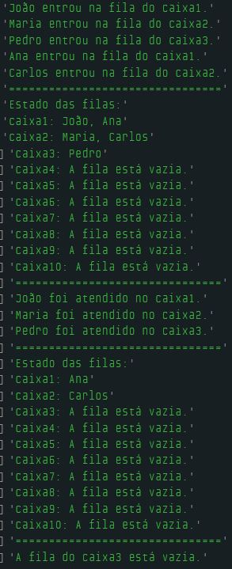

# Dia 14 - Super Desafio de Estrutura de Dados

## DESAFIO: Controlar filas de vários caixas de supermercado

**Descrição**: Vamos retomar o desafio de controle de filas de supermercado, mas agora com a diferença de que teremos várias filas ao mesmo tempo, uma para cada caixa.

O objetivo é simular um supermercado com diversos caixas, cada um com sua fila de clientes.

- Um cliente pode ser adicionado a uma das filas (caixas).
- O cliente é atendido e removido da fila correspondente.

```js
// Criação do conjunto de filas para 10 caixas
let filasCaixas = {
    caixa1: [],
    caixa2: [],
    caixa3: [],
    caixa4: [],
    caixa5: [],
    caixa6: [],
    caixa7: [],
    caixa8: [],
    caixa9: [],
    caixa10: []
};

function entrarNaFila(caixa, nome) {
    if (filasCaixas[caixa]) {
        filasCaixas[caixa][filasCaixas[caixa].length] = nome;
        console.log(`${nome} entrou na fila do ${caixa}.`);
    } else {
        console.log(`O ${caixa} não existe.`);
    }
}

// Atender o primeiro cliente da fila
function atenderCliente(caixa) {
    if (filasCaixa[caixa] && filasCaixa[caixa].length > 0) {
        let clienteAtendido = filasCaixa[caixa][0];
        // remove o primeiro cliente
        for (let i = 1; i < filasCaixas[caixa].length; i++) {
            filasCaixas[caixa][i - 1] = filasCaixas[caixa][i];
        }

        filasCaixas[caixa].length -= 1; // reduz o tamanho da fila
        console.log(`${ClienteAtendido} foi atendido no ${caixa}.`);
    } else if (filasCaixa[caixa]) {
        console.log(`A fila do ${caixa} está vazia.`);
    } else {
        console.log(`O ${caixa} não existe.`);
    }
}

// Mostra o status de todas as filas
function mostrarFilas() {
    console.log("Estado das filas:");

    for (let caixa in filasCaixas) {
        if (filasCaixas[caixa].length > 0) {
            console.log(`${caixa}: ${filasCaixas[caixa].join(", ")}`);
        } else {
            console.log(`${caixa}: A fila está vazia.`);
        }
    }
}

// Clientes adicionados em diferentes caixas
entrarNaFila("caixa1", "João");
entrarNaFila("caixa2", "Maria");
entrarNaFila("caixa3", "Pedro");
entrarNaFila("caixa1", "Ana");
entrarNaFila("caixa2", "Carlos");

console.log("===================================");

mostrarFilas(); // Mostra o status de todas as filas

console.log("===================================");

atenderCliente("caixa1");
atenderCliente("caixa2");
atenderCliente("caixa3");

console.log("===================================");

mostrarFilas(); // Mostra o status de todas as filas

console.log("===================================");

// Atendendo uma fila vazia
atenderCliente("caixa3");
```

