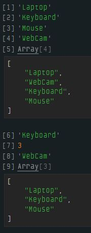

# Dia 15 - Lista Encadeada com Objeto Literal

## DESAFIO: Lista encadeada de um trem

**Descrição**: Terminar de implementar as outras funções que estão faltando para trabalhar com lista encadeada como:

- `insertLast` que inclui um nó no final da lista;
- `insertAt` que inclui um nó em uma determinada posição;
- `deleteAt` que exlui um nó em uma determinada posição;
- `searchAt` que encontra um nó de acordo com a posição;
- `traversal` que percorre todos os nós;
- `indexOf` que retorna a posição de acordo com o elemento do nó.

```js
// Criando o nó da lista encadeada
function criarNo(elemento) {
    return {
        data: elemento,
        next: null
    };
}

// Estrutura básica da lista encadeada
let listaEncadeada = {
    head: null,

    // Novo nó no início da fila
    insertFirst: function(elemento) {
        const novoNo = criarNo(elemento);
        if (!this.head) {
            this.head = novoNo;
        } else {
            novoNo.next = this.head;
            this.head = novoNo;
        }
        return elemento;
    },

    // Novo nó no fim da fila
    insertLast: function(elemento) {
        const novoNo = criarNo(elemento);

        if (!this.head) {
            this.head = novoNo;
        } else {
            let atual = this.head;
            while (atual.next) {
                atual = atual.next;
            }
            atual.next = novoNo;
        }
        return elemento;
    },

    // Novo nó em uma determinada posição
    insertAt: function(elemento, posicao) {
        const novoNo = criarNo(elemento);

        if (posicao === 0) {
            novoNo.next = this.head;
            this.head = novoNo;
            return elemento;
        }

        let atual = this.head;
        let anterior = null;
        let contador = 0;

        while (contador < posicao && atual) {
            anterior = atual;
            atual = atual.next;
            contador++;
        }

        if (contador === posicao) {
            anterior.next = novoNo;
            novoNo.next = atual;
            return elemento;
        } else {
            console.log("Posição inválida.");
            return null;
        }
    },

    // Excluir um nó em uma determinada posição
    deleteAt: function(posicao) {
        if (!this.head) {
            console.log("A lista está vazia.");
            return null;
        }

        if (posicao === 0) {
            const elementoRemovido = this.head.data;
            this.head = this.head.next;
            return elementoRemovido;
        }

        let atual = this.head;
        let anterior = null;
        let contador = 0;

        while (contador < posicao && atual) {
            anterior = atual;
            atual = atual.next;
            contador++;
        }

        if (atual) {
            anterior.next = atual.next;
            return atual.data;
        } else {
            console.log("Posição inválida.");
            return null;
        }
    },
    
    // Pesquisa em uma determinada posição
    searchAt: function(posicao) {
        let atual = this.head;
        let contador = 0;

        while (contador < posicao && atual) {
            atual = atual.next;
            contador++;
        }

        if (atual) {
            return atual.data;
        } else {
            console.log("Posição inválida.");
            return null;
        }
    },

    // Percorre todos os nós
    traversal: function() {
        let atual =  this.head;
        let resultado = [];

        while (atual) {
            resultado.push(atual.data);
            atual = atual.next;
        }

        return resultado;
    },

    // Retorna a posição de acordo com o elemento do nó
    indexOf: function(elemento) {
        let atual = this.head;
        let contador = 0;

        while (atual) {
            if (atual.data === elemento) {
                return contador;
            }
            atual = atual.next;
            contador++;
        }

        console.log("Elemento não encontrado.");
        return -1;
    }
};

// Testando as funções da lista encadeada
console.log(listaEncadeada.insertFirst("Laptop"));  // Insere elemento no início da lista
console.log(listaEncadeada.insertLast("Keyboard")); // Insere elemento no fim da lista
console.log(listaEncadeada.insertLast("Mouse"));    // Insere elemento no fim da lista
console.log(listaEncadeada.insertAt("WebCam", 1));  // Insere elemento na posição 1 na lista
console.log(listaEncadeada.traversal());            // Mostra todos os nós da lista
console.log(listaEncadeada.searchAt(2));            // Encontra o elemento na posição 2 na lista
console.log(listaEncadeada.indexOf("Mouse"));       // Encontra a posição do elemento na lista
console.log(listaEncadeada.deleteAt(1));            // Remove o nó na posição 1 da lista
console.log(listaEncadeada.traversal());            // Mostra todos os nós da lista
```

