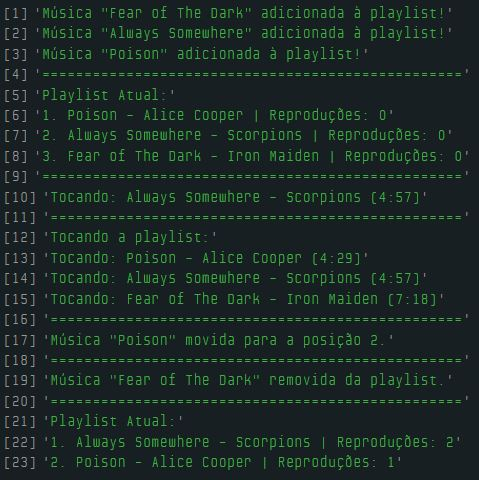

# Dia 16 - Desafio da Playlist de Música

## DESAFIO: Playlist de Músicas em um App

**Descrição**:

1. Capacidade de adicionar e remover músicas.
2. Mostrar todas as músicas da playlist.
3. Toda vez que uma música é adicionada, ela é colocada no início da playlist.
4. É possível mover a posição da música na playlist a qualquer momento.
5. Função para tocar a playlist do início ao fim.
6. Capacidade para tocar apenas uma música da playlist.
7. As músicas devem ter os seguintes atributos: nome da música, nome do artista, número de reproduções e tempo total da música
8. Cada vez que uma música é tocada é preciso incrementar o número de reproduções.

```js
// Criar música em formato JSON
function criarMusica(nome, artista, tempo) {
    return {
        nome: nome,
        artista: artista,
        reproducoes: 0,
        tempo: tempo
    };
}

// Estrutura da playlist usando um Objeto Literal
const playlist = {
    musicas: [], // Array para armazenar as músicas

    adicionarMusica: function(nome, artista, tempo) {
        const novaMusica = criarMusica(nome, artista, tempo);

        for (let i = this.musicas.length; i > 0; i--) {
            this.musicas[i] = this.musicas[i - 1];
        }

        this.musicas[0] = novaMusica;
        console.log(`Música "${nome}" adicionada à playlist!`);
    },

    removerMusica: function(nome) {
        let index = -1;

        for (let i = 0; i < this.musicas.length; i++) {
            if (this.musicas[i].nome === nome) {
                index = i;
                break;
            }
        }
        
        if (index === -1) {
            console.log(`Música "${nome}" não encontrada.`);
            return;
        }

        for (let i = index; i < this.musicas.length - 1; i++) {
            this.musicas[i] = this.musicas[i + 1];
        }

        this.musicas.length--;
        console.log(`Música "${nome}" removida da playlist.`);
    },

    moverMusica: function(nome, novaPosicao) {
        let index = -1;

        for (let i = 0; i < this.musicas.length; i++) {
            if (this.musicas[i].nome === nome) {
                index = i;
                break;
            }
        }

        if (index === -1) {
            console.log(`Música "${nome}" não encontrada.`);
            return;
        }

        let musica = this.musicas[index];

        for (let i = index; i < this.musicas.length - 1; i++) {
            this.musicas[i] = this.musicas[i + 1];
        }
        this.musicas.length--;

        for (let i = this.musicas.length; i > novaPosicao; i--) {
            this.musicas[i] = this.musicas[i - 1];
        }
        this.musicas[novaPosicao] = musica;

        console.log(`Música "${nome}" movida para a posição ${novaPosicao + 1}.`);
    },

    // Toca toda a playlist do início ao fim
    tocarPlaylist: function() {
        if (this.musicas.length === 0) {
            console.log("A playlist está vazia.");
            return;
        }
        console.log("Tocando a playlist:");
        for (let i = 0; i < this.musicas.length; i++) {
            this.musicas[i].reproducoes++;
            console.log(`Tocando: ${this.musicas[i].nome} - ${this.musicas[i].artista} (${this.musicas[i].tempo})`);
        }
    },

    // Toca apenas uma música específica
    tocarMusica: function(nome) {
        for (let i = 0; i < this.musicas.length; i++) {
            if (this.musicas[i].nome === nome) {
                this.musicas[i].reproducoes++;
                console.log(`Tocando: ${this.musicas[i].nome} - ${this.musicas[i].artista} (${this.musicas[i].tempo})`);
                return;
            }
        }
        console.log(`Música "${nome}" não encontrada.`);
    },

    // Exibe as músicas na playlist atual
    mostrarPlaylist: function() {
        if (this.musicas.length === 0) {
            console.log("A playlist está vazia.");
        } else {
            console.log("Playlist Atual:");
            for (let i = 0; i < this.musicas.length; i++) {
                console.log(`${i + 1}. ${this.musicas[i].nome} - ${this.musicas[i].artista} | Reproduções: ${this.musicas[i].reproducoes}`);
            }
        }
    }
};

// Testando a playlist
playlist.adicionarMusica("Fear of The Dark", "Iron Maiden", "7:18");
playlist.adicionarMusica("Always Somewhere", "Scorpions", "4:57");
playlist.adicionarMusica("Poison", "Alice Cooper", "4:29");

console.log("==================================================");

playlist.mostrarPlaylist();

console.log("==================================================");

playlist.tocarMusica("Always Somewhere");

console.log("=================================================");

playlist.tocarPlaylist();

console.log("=================================================");

playlist.moverMusica("Poison", 1);

console.log("=================================================");

playlist.removerMusica("Fear of The Dark");

console.log("=================================================");

playlist.mostrarPlaylist();
```

