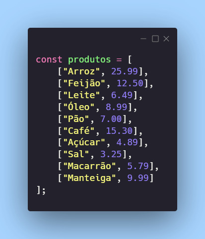
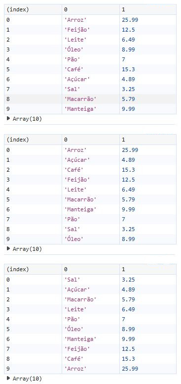

# Dia 17 - Ordenação: Organizando a Bagunça

## DESAFIO: Ordenando Produtos por Preço

**Descrição**: Imagine que nós temos uma lista de produtos de um mercado em um array onde temos o nome e o preço de venda. Ou seja, nós teremos um array dentro de outro array. Como no código abaixo:



O desafio será criar a função de ordenação desse array.

```js
// Lista de produtos com nomes e preços
const produtos = [
    ["Arroz", 25.99],
    ["Feijão", 12.50],
    ["Leite", 6.49],
    ["Óleo", 8.99],
    ["Pão", 7.00],
    ["Café", 15.30],
    ["Açúcar", 4.89],
    ["Sal", 3.25],
    ["Macarrão", 5.79],
    ["Manteiga", 9.99]
];

// Ordenar produtos por nome
function ordenarPorNome(arr) {
    let n = arr.length;

    for (let i = 0; i < n - 1; i++) {
        let minIndex = i;

        for (let j = i + 1; j < n; j++) {
            if (arr[j][0] < arr[minIndex][0]) { // Comparação pelo nome do produto
                minIndex = j;
            }
        }

        // Troca os elementos manualmente
        let temp = arr[i];
        arr[i] = arr[minIndex];
        arr[minIndex] = temp;
    }

    return arr;
}

// Ordenar produtos por preço
function ordenarPorPreco(arr) {
    let n = arr.length;

    for (let i = 0; i < n - 1; i++) {
        let minIndex = i;

        for (let j = i + 1; j < n; j++) {
            if (arr[j][1] < arr[minIndex][1]) { // Comparação pelo preço do produto
                minIndex = j;
            }
        }

        // Troca os elementos manualmente
        let temp = arr[i];
        arr[i] = arr[minIndex];
        arr[minIndex] = temp;
    }

    return arr;
}

// Testando as funções
console.log("Lista Original:");
console.table(produtos); // A primeira tabela da imagem abaixo mostra a lista original de produtos

console.log("Produtos Ordenados por Nome:");
console.table(ordenarPorNome(produtos.slice())); // A segunda tabela da imagem abaixo mostra a lista de produtos ordenada por nome

console.log("Produtos Ordenados por Preço:");
console.table(ordenarPorPreco(produtos.slice())); // A terceira tabela da imagem abaixo mostra a lista de produtos ordenada por preço
```

