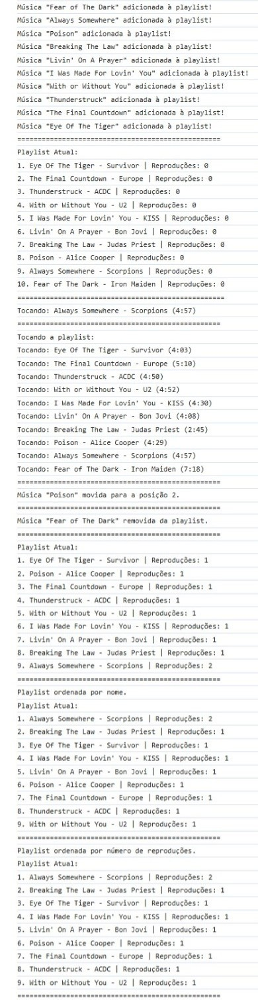

# Dia 18 - Ordenando a Playlist de Música

## DESAFIO: Ordenando a playlist

**Descrição**: Na playlist de músicas do dia 16, acrescente o que já foi feito. Utilize os algoritmos para *ordenar a playlist pelo título da música e também pelo número de reproduções.*

> **Observação**: Ordene por título utilizando o `Bubble Sort` e por número de reproduções com o `Selection Sort`.

```js
// Criar música em formato JSON
function criarMusica(nome, artista, tempo) {
    return {
        nome: nome,
        artista: artista,
        reproducoes: 0,
        tempo: tempo
    };
}

// Estrutura da playlist usando um Objeto Literal
const playlist = {
    musicas: [], // Array para armazenar as músicas

    adicionarMusica: function(nome, artista, tempo) {
        const novaMusica = criarMusica(nome, artista, tempo);

        for (let i = this.musicas.length; i > 0; i--) {
            this.musicas[i] = this.musicas[i - 1];
        }

        this.musicas[0] = novaMusica;
        console.log(`Música "${nome}" adicionada à playlist!`);
    },

    removerMusica: function(nome) {
        let index = -1;

        for (let i = 0; i < this.musicas.length; i++) {
            if (this.musicas[i].nome === nome) {
                index = i;
                break;
            }
        }
        
        if (index === -1) {
            console.log(`Música "${nome}" não encontrada.`);
            return;
        }

        for (let i = index; i < this.musicas.length - 1; i++) {
            this.musicas[i] = this.musicas[i + 1];
        }

        this.musicas.length--;
        console.log(`Música "${nome}" removida da playlist.`);
    },

    moverMusica: function(nome, novaPosicao) {
        let index = -1;

        for (let i = 0; i < this.musicas.length; i++) {
            if (this.musicas[i].nome === nome) {
                index = i;
                break;
            }
        }

        if (index === -1) {
            console.log(`Música "${nome}" não encontrada.`);
            return;
        }

        let musica = this.musicas[index];

        for (let i = index; i < this.musicas.length - 1; i++) {
            this.musicas[i] = this.musicas[i + 1];
        }
        this.musicas.length--;

        for (let i = this.musicas.length; i > novaPosicao; i--) {
            this.musicas[i] = this.musicas[i - 1];
        }
        this.musicas[novaPosicao] = musica;

        console.log(`Música "${nome}" movida para a posição ${novaPosicao + 1}.`);
    },

    // Toca toda a playlist do início ao fim
    tocarPlaylist: function() {
        if (this.musicas.length === 0) {
            console.log("A playlist está vazia.");
            return;
        }
        console.log("Tocando a playlist:");
        for (let i = 0; i < this.musicas.length; i++) {
            this.musicas[i].reproducoes++;
            console.log(`Tocando: ${this.musicas[i].nome} - ${this.musicas[i].artista} (${this.musicas[i].tempo})`);
        }
    },

    // Toca apenas uma música específica
    tocarMusica: function(nome) {
        for (let i = 0; i < this.musicas.length; i++) {
            if (this.musicas[i].nome === nome) {
                this.musicas[i].reproducoes++;
                console.log(`Tocando: ${this.musicas[i].nome} - ${this.musicas[i].artista} (${this.musicas[i].tempo})`);
                return;
            }
        }
        console.log(`Música "${nome}" não encontrada.`);
    },

    // Exibe as músicas na playlist atual
    mostrarPlaylist: function() {
        if (this.musicas.length === 0) {
            console.log("A playlist está vazia.");
        } else {
            console.log("Playlist Atual:");
            for (let i = 0; i < this.musicas.length; i++) {
                console.log(`${i + 1}. ${this.musicas[i].nome} - ${this.musicas[i].artista} | Reproduções: ${this.musicas[i].reproducoes}`);
            }
        }
    },

    // Ordena as músicas por nome (utilizando Bubble Sort)
    ordenarPorNome: function() {
        let n = this.musicas.length;
        let trocado;

        do {
            trocado = false;
            for (let i = 0; i < n - 1; i++) {
                if (this.musicas[i].nome > this.musicas[i + 1].nome) {
                    let temp = this.musicas[i];
                    this.musicas[i] = this.musicas[i + 1];
                    this.musicas[i + 1] = temp;
                    trocado = true;
                }
            }
        } while (trocado);

        console.log("Playlist ordenada por nome.");
    },

    // Ordena as músicas por número de reproduções (utilizando Selection Sort)
    ordenarPorReproducoes: function() {
        let n = this.musicas.length;

        for (let i = 0; i < n - 1; i++) {
            let maxIndex = i;

            for (let j = i + 1; j < n; j++) {
                if (this.musicas[j].reproducoes > this.musicas[maxIndex].reproducoes) {
                    maxIndex = j;
                }
            }

            let temp = this.musicas[i];
            this.musicas[i] = this.musicas[maxIndex];
            this.musicas[maxIndex] = temp;
        }

        console.log("Playlist ordenada por número de reproduções.");
    }
};

// Testando a playlist
playlist.adicionarMusica("Fear of The Dark", "Iron Maiden", "7:18");
playlist.adicionarMusica("Always Somewhere", "Scorpions", "4:57");
playlist.adicionarMusica("Poison", "Alice Cooper", "4:29");
playlist.adicionarMusica("Breaking The Law", "Judas Priest", "2:45");
playlist.adicionarMusica("Livin' On A Prayer", "Bon Jovi", "4:08");
playlist.adicionarMusica("I Was Made For Lovin' You", "KISS", "4:30");
playlist.adicionarMusica("With or Without You", "U2", "4:52");
playlist.adicionarMusica("Thunderstruck", "ACDC", "4:50");
playlist.adicionarMusica("The Final Countdown", "Europe", "5:10");
playlist.adicionarMusica("Eye Of The Tiger", "Survivor", "4:03");

console.log("==================================================");

playlist.mostrarPlaylist();

console.log("==================================================");

playlist.tocarMusica("Always Somewhere");

console.log("=================================================");

playlist.tocarPlaylist();

console.log("=================================================");

playlist.moverMusica("Poison", 1);

console.log("=================================================");

playlist.removerMusica("Fear of The Dark");

console.log("=================================================");

playlist.mostrarPlaylist();
```

### Adição de novas músicas na playlist para um resultado mais realista.

