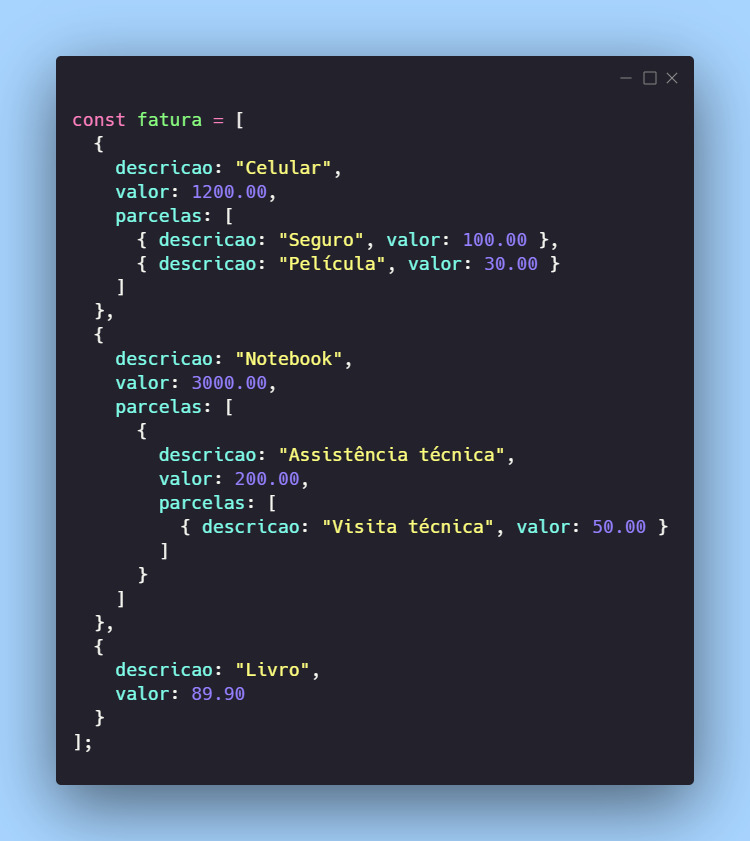
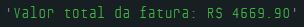

# Dia 19 - Recursão ("Inception" na Estrutura de Dados)

## DESAFIO: Parcelas Fatura Cartão de Crédito

**Descrição**: Crie um sistema que simula o cálculo do valor total de uma fatura de cartão de crédito.

O sistema deve considerar compras feitas no cartão, sendo que algumas delas podem ser parceladas, e cada parcela pode ter sub-parcelas (compras dentro de compras).

Utilize `recursão` para calcular o valor total da fatura, levando em consideração todas as compras, parcelas e sub-parcelas, até o nível mais profundo.



```js
const fatura = [
  {
    descricao: "Celular",
    valor: 1200.00,
    parcelas: [
      { descricao: "Seguro", valor: 100.00 },
      { descricao: "Película", valor: 30.00 }
    ]
  },
  {
    descricao: "Notebook",
    valor: 3000.00,
    parcelas: [
      {
        descricao: "Assistência técnica",
        valor: 200.00,
        parcelas: [
          { descricao: "Visita técnica", valor: 50.00 }
        ]
      }
    ]
  },
  {
    descricao: "Livro",
    valor: 89.90
  }
];

// Calcular o valor total da fatura
function calcularTotal(fatura) {
  let total = 0;

  for (let i = 0; i < fatura.length; i++) {
    const item = fatura[i];
    total += item.valor;

    if (item.parcelas) {
      total += calcularTotal(item.parcelas); // chamada resurciva para somar sub-parcelas
    }
  }

  return total;
}

const totalFatura = calcularTotal(fatura);

console.log(`Valor total da fatura: R$ ${totalfatura.toFixed(2)}`);
```

