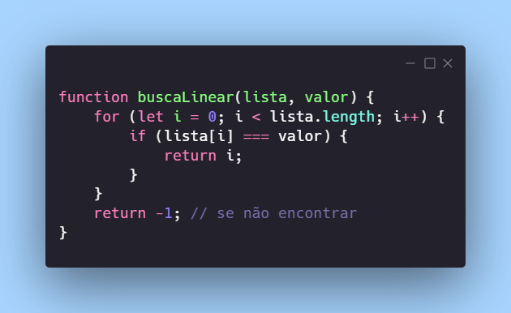
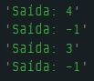
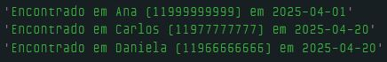

# Dia 20 - Busca é a Mágica da Programação

## DESAFIO 01: Busca Binária com Recursividade

**Descrição**: Implemente a `busca binária` de um array de números, porém utilizando `recursividade`, assim como mostramos na busca linear.

Teste também com um array com nomes para ver como funcionará.



```js
function buscaBinariaRecursiva(lista, valor, inicio = 0, fim = lista.length - 1) {
    if (inicio > fim) {
        return -1; // valor não encontrado
    }

    const meio = Math.floor((inicio + fim) / 2);

    if (lista[meio] === valor) {
        return meio; // valor encontrado
    }

    if (valor < lista[meio]) {
        return buscaBinariaRecursiva(lista, valor, inicio, meio - 1);
    }

    return buscaBinariaRecursiva(lista, valor, meio + 1, fim);
}

// Busca Binária Recursiva com números
const numeros = [5, 10, 15, 20, 25, 30, 35, 40];
console.log(`Saída: ${buscaBinariaRecursiva(numeros, 25)}`); // Saída: 4
console.log(`Saída: ${buscaBinariaRecursiva(numeros, 13)}`); // Saída: -1

// Busca Binária Recursiva com nomes
const nomes = ["Ana", "Bruno", "Carlos", "Daniel", "Eduarda", "Fernanda", "Gabriel"];
console.log(`Saída: ${buscaBinariaRecursiva(nomes, "Daniel")}`); // Saída: 3
console.log(`Saída: ${buscaBinariaRecursiva(nomes, "João")}`);   // Saída: -1
```



## DESAFIO 02: Busca Linear Recursiva com Múltiplos Resultados

Realize uma `busca linear`, utilizando `recursividade`, porém ao invés de retornar o índice do primeiro que foi encontrado apenas, quero que você retorne todos os índices que contém uma determinada palavra.

```js
const mensagens = [
    {
        nome: "Ana",
        mensagem: "Oi, você viu o relatório que mandei ontem?",
        telefone: "11999999999",
        data: "2025-04-01"
    },
    {
        nome: "Bruno",
        mensagem: "Vamos almoçar juntos amanhã?",
        telefone: "11988888888",
        data: "2025-04-15"
    },
    {
        nome: "Carlos",
        mensagem: "Segue o relatório atualizado.",
        telefone: "11977777777",
        data: "2025-04-20"
    },
    {
        nome: "Daniela",
        mensagem: "Relatório final enviado. Verifique!",
        telefone: "11966666666",
        data: "2025-04-20"
    },
    {
        nome: "Vanessa Weber",
        mensagem: "Está chegando ao fim do Desafio do Código Fonte TV",
        telefone: "12977445588",
        data: "2025-04-21"
    }
];

function buscarMensagensPorPalavra(lista, palavra, indice = 0, encontrados = []) {
    if (indice >= lista.length) {
        return encontrados;
    }

    const msg = lista[indice].mensagem.toLowerCase();
    const termo = palavra.toLowerCase();

    if (msg.includes(termo)) {
        encontrados.push(indice);
    }

    return buscarMensagensPorPalavra(lista, palavra, indice + 1, encontrados);
}

const resultado = buscarMensagensPorPalavra(mensagens, "relatório");

// Exibe mensagens encontradas
for (let i = 0; i < resultado.length; i++) {
    const index = resultado[i];
    const { nome, telefone, data } = mensagens[index];

    console.log(`Encontrado em ${nome} (${telefone}) em ${data}`);
}
```

