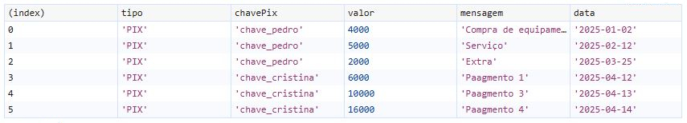
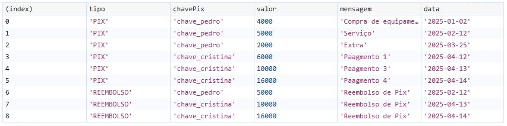
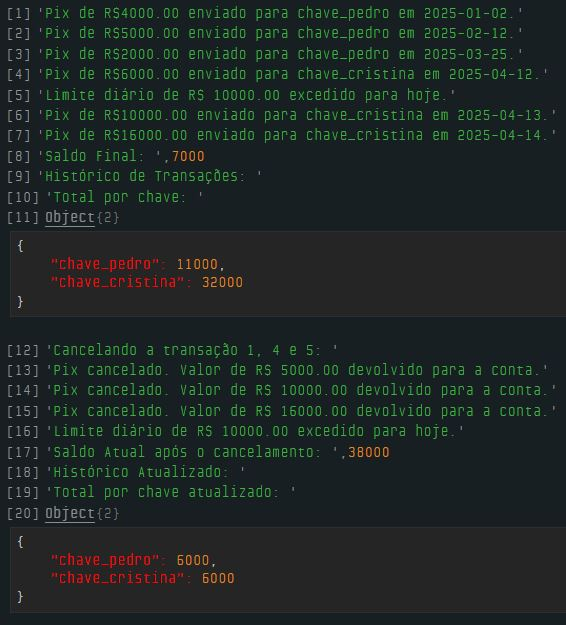

# Dia 21 - Super Desafio Final

## DESAFIO: Simulador de Transações Pix

**Descrição**: Crie um código para simular transações pix em uma conta bancária, utilizando as seguintes regras:

1. O limite diário para transferencias (R$ 10.000), um histórico de transações por Pix e também um total já transferido por chave Pix.
2. Deverá implementar 2 operações Pix, uma para enviar o Pix e outra para cancelar (reembolso).
3. A conta terá um limite máximo diário de R$ 10.000 para realizar o Pix.
4. Existirá um total armazenado de todos os Pix realizados para uma mesma chave `totalPorChave`.

```js
// Conta do usuário
const conta = {
    saldo: 50000,
    limiteDiario: 10000,
    totalTransferirdoHoje: 0,
    historicoTransacoes: [],
    totalPorChave: {}
};

// Enviar Pix
function enviarPix(chavePix, valor, mensagem = "", data) {
    if (!conta.totalPorChave[chavePix]) {
        conta.totalPorChave[chavePix] = 0;
    }

    const totalParaEssaChave = conta.totalPorChave[chavePix];
    const limitePermitido = totalParaEssaChave > conta.limiteDiario
        ? totalParaEssaChave
        : conta.limiteDiario;
    
    // Calcula o total transferido hoje
    let totalHoje = 0;

    for (let i = 0; i < conta.historicoTransacoes.length; i++) {
        const transacao = conta.historicoTransacoes[i];
        if (transacao.data === data && transacao.tipo === "PIX") {
            totalHoje += transacao.valor;
        }
    }

    // Validações
    if (totalHoje + valor > limitePermitido) {
        console.log(`Limite diário de R$ ${limitePermitido.toFixed(2)} excedido para hoje.`);
        return;
    }

    if (conta.saldo < valor) {
        console.log("Saldo insuficiente.");
        return;
    }

    // Realiza a transferência
    conta.saldo -= valor;
    conta.totalPorChave[chavePix] += valor;

    conta.historicoTransacoes.push({
        tipo: "PIX",
        chavePix,
        valor,
        mensagem,
        data
    });

    console.log(`Pix de R$${valor.toFixed(2)} enviado para ${chavePix} em ${data}.`);
}

// Cancelar Pix
function cancelarPix(indiceTransacao, dataTransacao) {
    const transacao = conta.historicoTransacoes[indiceTransacao];

    if (!transacao || transacao.tipo !== "PIX") {
        console.log("Transação inválida para cancelamento.");
        return;
    }

    const { chavePix, valor, data } = transacao;

    // Estorna o valor
    conta.saldo += valor;

    // Atualiza total por chave
    conta.totalPorChave[chavePix] -= valor;

    // Registra o reembolso
    conta.historicoTransacoes.push({
        tipo: "REEMBOLSO",
        chavePix,
        valor,
        mensagem: "Reembolso de Pix",
        data
    });

    console.log(`Pix cancelado. Valor de R$ ${valor.toFixed(2)} devolvido para a conta.`);
}

// TESTANDO O ENVIO DE PIX
enviarPix("chave_pedro", 4000, "Compra de equipamento", "2025-01-02");
enviarPix("chave_pedro", 5000, "Serviço", "2025-02-12");
enviarPix("chave_pedro", 2000, "Extra", "2025-03-09"); // Excederá limite diário

enviarPix("chave_pedro", 3000, "Nova transação", "2025-03-25"); // Novo dia

// Acumulando para liberar o limite por chave:
enviarPix("chave_cristina", 6000, "Paagmento 1", "2025-04-12");
enviarPix("chave_cristina", 5000, "Paagmento 2", "2025-04-12"); // Deve bloquear

enviarPix("chave_cristina", 10000, "Paagmento 3", "2025-04-13"); // Limite diário
enviarPix("chave_cristina", 16000, "Paagmento 4", "2025-04-14"); // Deve passar

console.log("Saldo Final: ", conta.saldo);
console.log("Histórico de Transações: ");
console.table(conta.historicoTransacoes); // Resultado do 'console.table()' abaixo:
```



```js
console.log("Total por chave: ");
console.log(conta.totalPorChave);

// CANCELAMENTO DO PIX
console.log("Cancelando a transação 1, 4 e 5: ");
cancelarPix(1); // Índice 1 da transação oridinal do Pix
cancelarPix(4); // Índice 4 da transação oridinal do Pix
cancelarPix(5); // Índice 5 da transação oridinal do Pix

enviarPix("chave_cristina", 16000, "Pagamento 4", "2025-04-15"); // Não deve passar

console.log("Saldo Atual após o cancelamento: ", conta.saldo);
console.log("Histórico Atualizado: ");
console.table(conta.historicoTransacoes);
```



```js
console.log("Total por chave atualizado: ");
console.log(conta.totalPorChave);
```

