# Dia 3 - Aprenda a Usar os Operadores

## DESAFIO 01:

### Para Soma:

1. Adicione uma nova pontuação a um total de pontos existente em um jogo fictício.

```js
let pontuacaoAtual = 1200;
let novosPontos = 500;

console.log("Pontuação Total: " + pontuacaoAtual + " pontos");
console.log("Novos Pontos: " + novosPontos + " pontos");

pontuacaoAtual = (pontuacaoAtual + novosPontos);

console.log("Pontuação Total: " + pontuacaoAtual + " pontos");
```

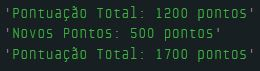

2. Para cada dia da semana defina a quantidade de horas trabalhadas e some o total.

```js
let segundaFeira = 8;
let tercaFeira = 8;
let quartaFeira = 8;
let quintaFeira = 8;
let sextaFeira = 8;
let sabado = 4;
let domingo = 0;

let totalHorasTrabalhadas = (segundaFeira + 
                             tercaFeira + 
                             quartaFeira + 
                             quintaFeira + 
                             sextaFeira + 
                             sabado + 
                             domingo);

console.log("Horas trabalhadas na semana: " + totalHorasTrabalhadas + " horas.");
```

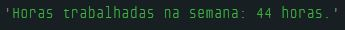

3. Imagine que na sua casa 3 pessoas ganham salários diferentes, some eles para saber o ganho total.

```js
const pedroSalario = 1750;
const jonasSalario = 3860;
const sauloSalario = 4517;

let somaDosSalarios = (pedroSalario + jonasSalario + sauloSalario);

console.log("Salário do Pedro: R$ " + pedroSalario.toFixed(2));
console.log("Salário do Jonas: R$ " + jonasSalario.toFixed(2));
console.log("Salário do Saulo: R$ " + sauloSalario.toFixed(2));
console.log("-------------------------------");
console.log("Soma dos salários: R$ " + somaDosSalarios.toFixed(2));
```

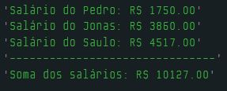

### Para Subtração:

1. Imagine que você tem algumas variáveis com compras no cartão de crédito, e uma com um valor a ser estornado de uma compra errada, calcule o total da fatura atualizado.

```js
let valorDasCompras = 475; // valor em Reais
let valorEstornado = 150;  // valor em Reais

// Valor a ser estornado
let totalDaFatura = (valorDasCompras - valorEstornado);

console.log("Valor total das compras: R$: " + valorDasCompras);
console.log("Valor a ser estornado: R$: " + valorEstornado);
console.log("Total da fatura a ser pago: R$ " + totalDaFatura);
```

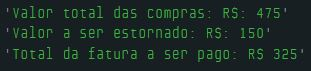

2. Calcule a sua idade a partir de duas variáveis contendo o ano de nascimento e o ano atual.

```js
const anoNascimento = 1990;
let anoAtual = 2025;
let minhaIdade = (anoAtual - anoNascimento);

console.log("Ano de Nascimento: " + anoNascimento);
console.log("Ano Atual: " + anoAtual);

console.log("Minha idade é: " + minhaIdade + " anos");
```

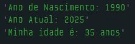

3. Imagine que em um jogo você tenha um total de moedas e para cada vez que você compra um artefato você gasta um determinado número de moedas. Calcule a quantidade final de moedas.

```js
let moedasTotais = 3500;
console.log("Total de Moedas: $" + moedasTotais);

// Itens comprados
let precoEspada = 275;
let precoArmadura = 546;

moedasTotais = moedasTotais - precoEspada;
moedasTotais = moedasTotais - precoArmadura;

console.log("Espada Comprada: $" + precoEspada);
console.log("Armadura Comprada: $" + precoArmadura);
console.log("Moedas Restantes: $" + moedasTotais);
```

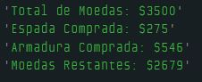

### Para Multiplicação:

1. Vamos supor que você tenha 2 produtos e que queira comprar 2 unidades de cada. Faça a multiplicação para encontrar o total.

```js
const camisaPrecoUnidade = 189.90;
const bermudaPrecoUnidade = 149.65;

let valorTotalCamisas = camisaPrecoUnidade * 2;
let valorTotalBermudas = bermudaPrecoUnidade * 2;

let valorTotal = (valorTotalCamisas + valorTotalBermudas);

console.log("Camisa - Preço da Unidade: R$ " + camisaPrecoUnidade.toFixed(2));
console.log("Bermuda - Preço da Unidade: R$ " + bermudaPrecoUnidade.toFixed(2));

console.log("-------------------------------------");

console.log("Camisa (2x un.) Total: R$ " + valorTotalCamisas.toFixed(2));
console.log("Bermuda (2x un.) Total: R$ " + valorTotalBermudas.toFixed(2));

console.log("-------------------------------------");

console.log("Valor Total a Ser Pago: R$ " + valorTotal.toFixed(2));
```

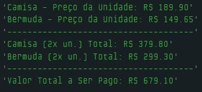

2. Calcule a área de um retângulo.

```js
let larguraRetangulo = 12;
let alturaRetangulo = 30;

// Área de um retângulo = Largura x Altura
let areaRetangulo = (larguraRetangulo * alturaRetangulo);

console.log("Largura do Retângulo: " + larguraRetangulo);
console.log("Algura do Retângulo: " + alturaRetangulo);

console.log("-------------------------------");

console.log("Área Total do Retângulo: " + areaRetangulo);
```

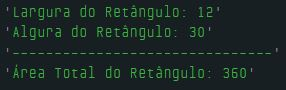

3. Crie 2 variáveis que contêm o total de horas trabalhadas e o valor por hora. Calcule o total a receber depois de trabalhar 160 horas.

```js
// Total de Horas Trabalhadas
let totalHorasTrabalhadas = 160;

// Valor por Hora Trabalhada
let valorHora = 15;

// Total a Receber
let totalReceber = (valorHora * totalHorasTrabalhadas);

console.log("Valor por hora trabalhada: R$ " + valorHora.toFixed(2));
console.log("Total de horas trabalhadas: " + totalHorasTrabalhadas);

console.log("-----------------------------------");

console.log("Total a Receber: R$ " + totalReceber.toFixed(2));
```

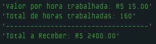

### Para Divisão:

1. Calcule a média de quatro notas.

```js
// Notas
let portugues = 9.5;
let matematica = 7.0;
let historia = 8.5;
let geografia = 6.5;

// Nota Média = Soma das notas dividido pela quantidade
let notaMedia = (portugues + matematica + historia + geografia) / 4;

console.log("Português: " + portugues.toFixed(1));
console.log("Matemática: " + matematica.toFixed(1));
console.log("História: " + historia.toFixed(1));
console.log("Geografia: " + geografia.toFixed(1));

console.log("------------------------");

console.log("A média das notas é: " + notaMedia.toFixed(1));
```

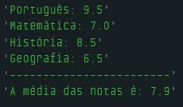

2. Converta a distância de metros para quilômetros.

```js
const quilometros = 1000; // Um quilômetro possui mil metros
let metros = 250;

let metrosParaQuilometros = (metros / quilometros);

console.log(metros + "m será convertido para quilômetros");

console.log("-------------------------------------");

console.log("Valor Convertido: " + metrosParaQuilometros.toFixed(2) + "km");
```

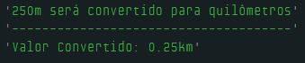

## DESAFIO 02: Par ou Ímpar

**Descrição**: Com o que você já sabe, quero que você crie um código que determine se um número é par. **Dica**: Para isso utilize exatamente o operador de módulo que explicamos.

```js
let numeroEscolhido = 5;
let resultado = numeroEscolhido % 2;

if (resultado == 0) {
  console.log("O número " + numeroEscolhido + " é par.");
} else {
  console.log("O número " + numeroEscolhido + " é ímpar.");
}
```

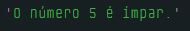

### DESAFIO 03: Cálculo IMC

**Descrição**: Calcule o IMC de uma pessoa (que é peso dividido pela algura ao quadrado).

- Se o resultado ficar menor que 18.5, mostra que está abaixo do peso;
- Se for maior ou igual a 18.5 e menor que 24.9, mostre que está com peso normal;
- Se for maior ou igual a 24.9 e menor que 29.9, mostre que está com sobrepeso, senão mostre que é obesidade.

```js
let peso = 75;
let altura = 1.75;

// A fórmula é: IMC = peso / (altura x altura)
let imc = peso / (altura * altura); // O resultado é dado em kg/m²
console.log("Seu IMC é: " + imc.toFixed(1));

// Verifica o IMC (Índice de Massa Corporal)
if (imc < 18.5) {
  console.log("Resultado: Abaixo do peso");
} else if ((imc >= 18.5) && (imc < 24.9)) {
  console.log("Resultado: Peso normal");
} else if ((imc >= 24.9) && (imc < 29.9)) {
  console.log("Resultado: Sobrepeso");
} else {
  console.log("Resultado: Obesidade");
}
```

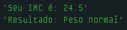

## DESAFIO 04: Cálculo de distância de viagem e custo de combustível

**Descrição**: Suponha que você está planejando uma viagem de carro. Seu carro faz 12km por litro de gasolina, e você quer calcular o número de litros de combustível que você precisará para a viagem, bem como o custo total do combustível.

- Distrância total da viagem em quilômetros
- Preço do litro de gasolina em reais

1. Quantos litros de gasolina serão necessários para a viagem (considerando que o carro faz 12km por litro)?
2. Quanto vai custar para abastecer o carro para a viagem?

```js
let precoGasolina = 6.25;     // Preço do litro de gasolina
let distanciaDaViagem = 600;  // Distância da viagem em quilômetros
let quilometrosPorLitro = 12; // O carro faz 12km por litro

// Litros necessários para a viagem
let litrosNecessarios = (distanciaDaViagem / quilometrosPorLitro);

// Custo para abastecer o carro
let valorNecessario = (precoGasolina * litrosNecessarios);

console.log("Distância da viagem: " + distanciaDaViagem + "km");

console.log("Litros de gasolina necessários para a viagem: " + litrosNecessarios.toFixed(2) + " litros");

console.log("Valor total do abastecimento do carro: R$ " + valorNecessario.toFixed(2));
```

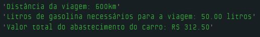