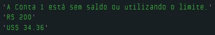

# Dia 07 - Super Desafio: Dividir Problemas em Uma Solução

## DESAFIO 01:

Crie uma aplicação simples que simule a gestão de duas contas bancárias. Para isso, você precisará criar variáveis para controlar o saldo das contas e o limite de crédito.

1. Calcular o saldo todal das contas.
2. Exibir um alerta se alguma conta estiver sem saldo ou utilizando o limite.
3. Permitir depósitos em uma das contas.
4. Permitir débitos em uma das contas.
5. Permitir transferências de uma conta para outra, desde que haja saldo disponível.
6. Converter o saldo de Reais (R$) para Dólares (US$).
7. Exibir o limite disponível das contas.

Se estiver realizando um depósito em uma conta e ela estiver usando um limite, desconte do valor a ser depositado 15%.

```js
let saldoConta1 = 800;
let saldoConta2 = 200;

let limite = 0;
let jurosLimite = 0;

const percentualLimite = 0.10;
const saldoMinimoLimite = 1000;

// Conversão Dólar -> Real
const conversaoDolar = 5.82;

function saldoTotal() {
    let total = (saldoConta1 + saldoConta2);

    if (total >= limite){
        limite = total * percentualLimite;
    }
    return "R$ " + total;
}

function alertaSaldo() {
    if (saldoConta1 <= 0) {
        console.log("A Conta 1 está sem saldo ou utilizando o limite.");
    }
    if (saldoConta2 <= 0) {
        console.log("A Conta 2 está sem saldo ou utilizando o limite.");
    }
}

function depositar(conta, valor) {
    if (conta === 1) {
        if (saldoConta1 < 0) {
            jurosLimite += valor * 0.15;
            valor *= 0.85;
        }
        saldoConta1 += valor;
    } else if (conta === 2) {
        if (saldoConta2 < 0) {
            jurosLimite += valor * 0.15;
            valor *= 0.85;
        }
        saldoConta2 += valor;
    }
}

function debitar(conta, valor) {
    if (conta === 1 && valor <= (saldoConta1 + limite)) {
        saldoConta1 -= valor;
    } else if (conta === 2 && valor <= (saldoConta2 + limite)) {
        saldoConta2 -= valor;
    } else {
        console.log("Saldo insuficiente para débito na conta " + conta);
    }
}

function transferir(valor, contaOrigem, contaDestino) {
    if (contaOrigem === 1 && valor <= saldoConta1) {
        debitar(1, valor);
        depositar(contaDestino, valor);
    } else if (contaOrigem === 2 && valor <= saldoConta2) {
        debitar(2, valor);
        depositar(contaDestino, valor);
    } else {
        console.log("Saldo insuficiente para transferência na conta " + contaOrigem);
    }
}

function converterParaDolar(conta) {
    if (conta === 1) {
        return "US$ " + (saldoConta1 / conversaoDolar).toFixed(2);
    } else if (conta === 2) {
        return "US$ " + (saldoConta2 / conversaoDolar).toFixed(2);
    }
}

function exibirLimite() {
    return limite;
}

function exibirJurosLimite() {
    return jurosLimite;
}

debitar(1, 800);
alertaSaldo();
console.log(saldoTotal());
console.log(converterParaDolar(2));
```

